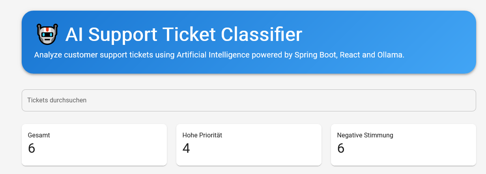
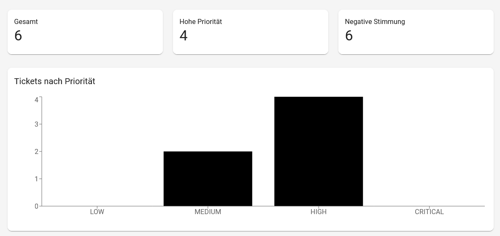
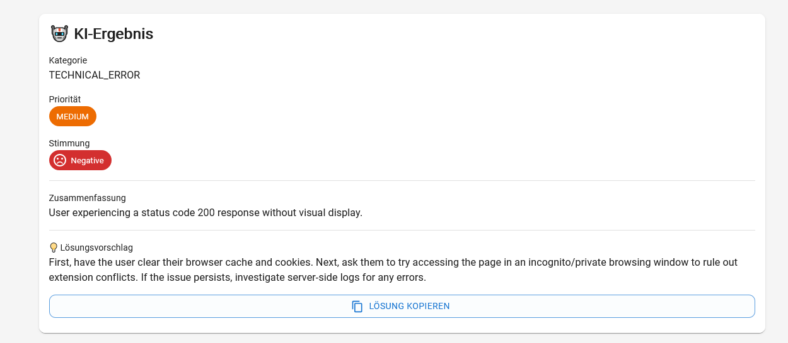
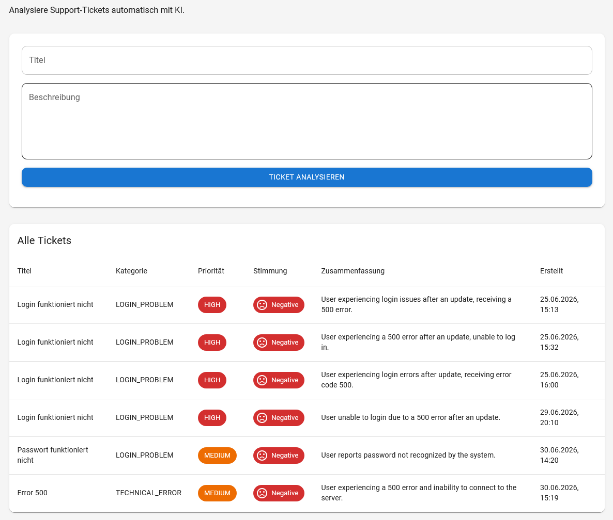

# 🤖 AI Support Ticket Classifier

An AI-powered full-stack application that automatically analyzes support tickets using a locally hosted Large Language Model (LLM).

The application classifies incoming support requests, determines their priority and sentiment, generates a concise summary, and provides an AI-generated first-level support recommendation.

---

## ✨ Features

- 🤖 AI-powered ticket analysis using **Ollama (Gemma)**
- 🗂️ Automatic ticket categorization
- 🚨 Priority detection (LOW, MEDIUM, HIGH, CRITICAL)
- 😊 Sentiment analysis
- 📝 AI-generated ticket summary
- 💡 AI-generated solution recommendation
- 📊 Interactive dashboard with statistics
- 📈 Ticket priority chart
- 🔍 Live search and filtering
- 🎨 Modern Material UI interface
- 🗄️ PostgreSQL persistence

---

## 🛠️ Tech Stack

### Backend

- Java 21
- Spring Boot
- Spring Web
- Spring Data JPA
- PostgreSQL
- Jackson
- Lombok

### AI

- Ollama
- Gemma 3 (4B)

### Frontend

- React
- TypeScript
- Vite
- Material UI
- Axios
- Recharts

---

## 🏗️ Architecture

```text
React + TypeScript
        │
        ▼
      Axios
        │
        ▼
Spring Boot REST API
        │
        ▼
 AI Analysis Service
        │
        ▼
 Ollama (Gemma)
        │
        ▼
 PostgreSQL
```

---

## 🚀 Workflow

1. User creates a support ticket.
2. The ticket is sent to the Spring Boot backend.
3. Ollama analyzes the ticket.
4. The AI returns:
   - Category
   - Priority
   - Sentiment
   - Summary
   - Solution Recommendation

5. The ticket is stored in PostgreSQL.
6. The dashboard updates automatically.

---

## 📊 Dashboard

The dashboard includes:

- Total ticket count
- High priority tickets
- Negative sentiment statistics
- Ticket priority chart
- AI recommendation panel
- Search functionality
- Ticket overview table

---

## 📸 Screenshots






Example:

- Dashboard
- Ticket Analysis
- AI Recommendation
- Ticket Table

---

## ⚙️ Installation

### Clone the repository

```bash
git clone https://github.com/YOUR_USERNAME/support-ticket-classifier.git
```

### Backend

```bash
cd support-ticket-classifier-backend
```

Configure PostgreSQL in:

```properties
application.properties
```

Run:

```bash
./mvnw spring-boot:run
```

---

### Ollama

Install Ollama and pull Gemma:

```bash
ollama pull gemma3:4b
```

Start Ollama before running the backend.

---

### Frontend

```bash
cd support-ticket-classifier-frontend
npm install
npm run dev
```

---

## 🔮 Future Improvements

- User authentication
- Ticket editing and deletion
- Docker deployment
- Dark Mode
- Role-based access control
- AI confidence score
- Export to PDF
- Email notifications

---

## 👨‍💻 Author

**Samir Schabel**

GitHub: https://github.com/samirschabel-25

Website: https://portfolio-five-liart-25.vercel.app/

## LinkedIn: https://www.linkedin.com/in/samir-schabel-47232a137/

## 📄 License

This project is licensed under the MIT License.
